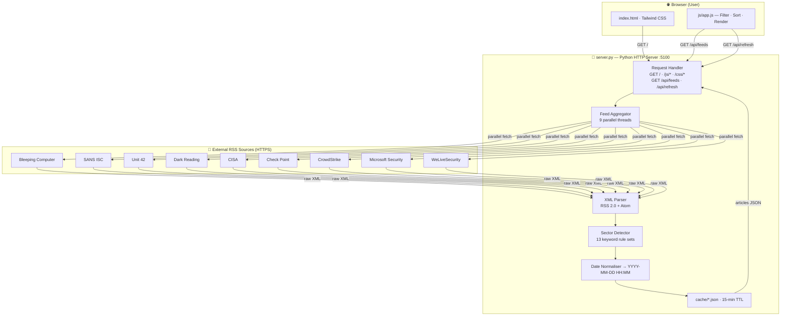
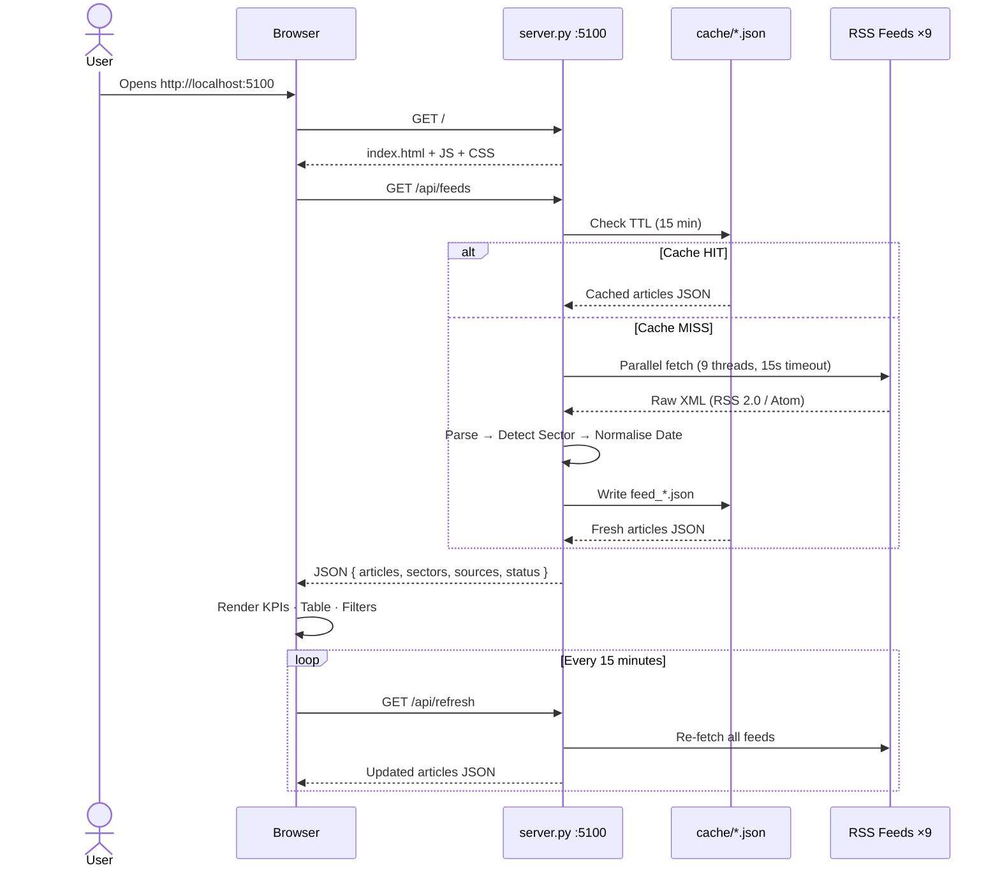
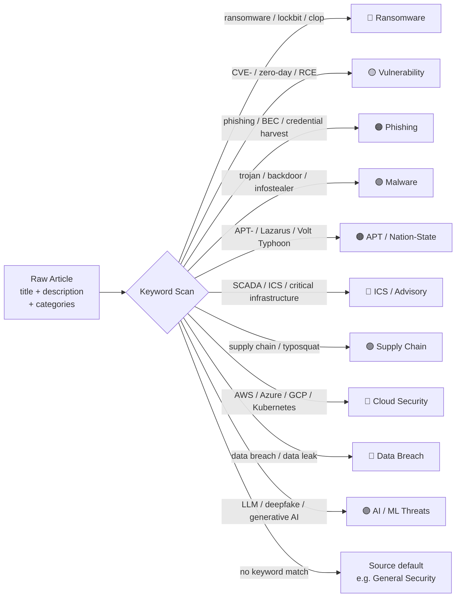

# Threat Intel Dashboard

A real-time cybersecurity threat intelligence aggregator that collects, categorises, and displays articles from 9 industry-leading security RSS feeds in a clean, filterable dashboard.

---

## 📸 Features

- **Live feed aggregation** from 9 threat intelligence sources
- **Auto-categorisation** into 13 threat sectors (Ransomware, APT, Vulnerability, etc.) using keyword detection
- **Filters** by source, sector, date range, and free-text search
- **Sortable table** — click any column header
- **Auto-refresh** every 15 minutes with countdown timer
- **15-minute server-side cache** — avoids hammering external feeds
- **Feed status indicators** — shows which sources are online and their article count
- **No external dependencies** — Python standard library only

---

## 🏗️ Architecture

```
┌─────────────────────────────────────────────────────────────────┐
│                          Browser (User)                         │
│                                                                 │
│   index.html ──── Tailwind CSS ──── js/app.js ──── css/styles  │
│       │                                  │                      │
│       │  GET /                           │  GET /api/feeds      │
│       │  GET /js/app.js                  │  GET /api/refresh    │
└───────┼──────────────────────────────────┼──────────────────────┘
        │                                  │
        ▼                                  ▼
┌──────────────────────────────────────────────────────────────────┐
│                     server.py  (Python HTTP Server)              │
│                         localhost:5100                           │
│                                                                  │
│  ┌─────────────────────────────────────────────────────────┐    │
│  │                   Request Handler                        │    │
│  │  GET /           → serve index.html                     │    │
│  │  GET /js/*       → serve static JS                      │    │
│  │  GET /css/*      → serve static CSS                     │    │
│  │  GET /api/feeds  → return JSON (articles + metadata)    │    │
│  │  GET /api/refresh→ force re-fetch all feeds             │    │
│  └──────────────────────────┬──────────────────────────────┘    │
│                             │                                    │
│  ┌──────────────────────────▼──────────────────────────────┐    │
│  │               Feed Aggregator (threaded)                 │    │
│  │                                                          │    │
│  │  9 threads fetch in parallel  ──►  XML parser           │    │
│  │                                        │                │    │
│  │                               ┌────────▼──────────┐     │    │
│  │                               │  Sector Detector  │     │    │
│  │                               │  (keyword rules)  │     │    │
│  │                               └────────┬──────────┘     │    │
│  │                                        │                │    │
│  │                               ┌────────▼──────────┐     │    │
│  │                               │   Date Normaliser │     │    │
│  │                               │ → YYYY-MM-DD HH:MM│     │    │
│  │                               └────────┬──────────┘     │    │
│  │                                        │                │    │
│  │                               ┌────────▼──────────┐     │    │
│  │                               │  cache/*.json     │     │    │
│  │                               │  (15-min TTL)     │     │    │
│  │                               └───────────────────┘     │    │
│  └──────────────────────────────────────────────────────────┘    │
└──────────────────────────────────────────────────────────────────┘
        │
        ▼  (outbound HTTPS)
┌───────────────────────────────────────────────────────┐
│                  External RSS Sources                  │
│                                                        │
│  bleepingcomputer.com   ·   isc.sans.edu              │
│  unit42.paloaltonetworks.com   ·   darkreading.com    │
│  cisa.gov   ·   research.checkpoint.com               │
│  crowdstrike.com   ·   microsoft.com   ·   welivesecurity.com │
└───────────────────────────────────────────────────────┘
```

---

### System Architecture (Mermaid)



---

### Request Flow (Mermaid)



---

### Sector Classification Pipeline (Mermaid)



---

## 📁 Project Structure

```
threat-intel-dashboard/
│
├── server.py            # Python backend — RSS fetcher, XML parser, HTTP API
├── index.html           # Main UI — Tailwind CSS layout, KPI cards, table
├── RUN_DASHBOARD.bat    # Windows one-click launcher
│
├── js/
│   └── app.js           # Frontend logic — fetch, filter, sort, render, pagination
│
├── css/
│   └── styles.css       # Custom styles (sector badges, table, scrollbar, animations)
│
└── cache/
    └── feed_*.json      # Auto-generated 15-min cache files (gitignored)
```

---

## ⚙️ How It Works

### 1. Server Startup
When `server.py` starts, it immediately spawns a background thread that fetches all 9 RSS feeds in parallel. Results are written to `cache/feed_<name>.json`.

### 2. Feed Fetching & Parsing
Each feed is fetched with a 15-second timeout. The raw XML (RSS 2.0 or Atom) is cleaned of namespace prefixes then parsed with Python's `xml.etree.ElementTree`. Up to 30 articles are extracted per feed.

### 3. Sector Detection
Each article's title, description, and categories are scanned against 13 keyword rule sets:

| Sector | Example Keywords |
|---|---|
| Ransomware | lockbit, blackcat, clop, ransom demand |
| Phishing | spear-phishing, credential harvest, BEC |
| Vulnerability | CVE-, zero-day, RCE, patch tuesday |
| Malware | trojan, RAT, backdoor, infostealer |
| APT / Nation-State | Lazarus, Volt Typhoon, Cozy Bear, espionage |
| ICS / Advisory | SCADA, OT security, critical infrastructure |
| Supply Chain | typosquat, dependency confusion |
| Cloud Security | AWS, Azure, GCP, Kubernetes |
| Data Breach | data leak, stolen data, leaked database |
| DDoS | denial of service, amplification |
| AI / ML Threats | LLM, deepfake, generative AI |
| Identity & Access | MFA bypass, Active Directory, Kerberos |
| Mobile Security | Android, iOS, mobile malware |

### 4. Date Normalisation
All date formats from all feeds are normalised to `YYYY-MM-DD HH:MM` so they sort chronologically (newest first). Unrecognised dates are pushed to the bottom.

### 5. Caching
Parsed results are cached to disk for 15 minutes. On subsequent requests within the TTL, the cached JSON is returned instantly without hitting the external feeds.

### 6. Frontend
The browser calls `GET /api/feeds` once on load. All filtering, sorting, and pagination happen entirely in the browser — no extra server requests needed.

---

## 🚀 Getting Started

### Prerequisites
- Python 3.8 or higher (no pip packages required)

### Run Locally

**Windows — double-click:**
```
RUN_DASHBOARD.bat
```

**Any OS — terminal:**
```bash
python server.py
# or on Windows:
py server.py
```

Then open: **http://localhost:5100**

> First load fetches all 9 feeds in parallel — allow up to 30 seconds.

---

## 🔍 Using the Dashboard

| Feature | How |
|---|---|
| Search | Type in the search box — filters title and description |
| Filter by source | Use the "All Sources" dropdown |
| Filter by sector | Use the "All Sectors" dropdown |
| Filter by date | Choose Today / Last 7 Days / Last 30 Days |
| Clear filters | Click the **✕ Clear** button |
| Sort columns | Click any column header (Title, Sector, Source, Date) |
| Read full article | Click the **Read ↗** button — opens original source |
| Force refresh | Click the **🔄 Refresh** button in the header |
| Auto-refresh | Dashboard refreshes automatically every 15 minutes |

---

## 🌐 Intel Sources

| Source | Focus |
|---|---|
| Bleeping Computer | Malware, ransomware, breaches |
| SANS ISC | Incident analysis, daily threat diaries |
| Unit 42 (Palo Alto) | Threat research, malware families, APTs |
| Dark Reading | General security news and analysis |
| CISA | US government advisories, ICS/OT |
| Check Point Research | Threat intelligence, vulnerability research |
| CrowdStrike Blog | Threat intelligence, adversary tracking |
| Microsoft Security | Microsoft-specific security research |
| WeLiveSecurity (ESET) | Malware analysis, APT campaigns |

---

## 🚢 Deploying to Production

### Option A — Render.com (Recommended, Free)

1. Push this project to a GitHub repository
2. Sign up at [render.com](https://render.com)
3. New → Web Service → connect your GitHub repo
4. Set **Start Command:** `python server.py`
5. Set **Environment:** Python 3
6. Deploy → get a public `https://your-app.onrender.com` URL

> **Before deploying:** replace `http.server` with Flask for production robustness and add:
> - `requirements.txt` containing `flask`
> - `Procfile` containing `web: python server.py`

### Option B — Azure App Service

```bash
az webapp up --name threat-intel-dashboard --runtime PYTHON:3.11 --sku F1
```

### Option C — LAN Sharing (quick internal share)

Change the bind address in `server.py`:
```python
HTTPServer(('0.0.0.0', PORT), Handler).serve_forever()
```
Others on your network can reach it at `http://your-machine-ip:5100`.

---

## ⚡ Configuration

All configuration is at the top of `server.py`:

```python
PORT      = 5100    # change to any free port
CACHE_TTL = 900     # cache duration in seconds (900 = 15 min)
```

To add or remove feeds, edit the `FEEDS` list:
```python
FEEDS = [
    {'name': 'My Feed', 'url': 'https://example.com/feed.xml', 'default_sector': 'General Security'},
    ...
]
```

To add new sector keyword rules, extend `SECTOR_KEYWORDS` in `server.py`:
```python
SECTOR_KEYWORDS = [
    (['keyword1', 'keyword2'], 'My Sector'),
    ...
]
```

---

## 🔒 Security Notes

- The server only makes **outbound** requests to the configured RSS feed URLs
- No user data is stored or logged
- The `/cache/` directory contains only raw RSS data — add it to `.gitignore` before pushing to GitHub
- For production, consider adding basic authentication if exposing externally

---

## 📝 .gitignore (recommended)

```
cache/
__pycache__/
*.pyc
.env
```
